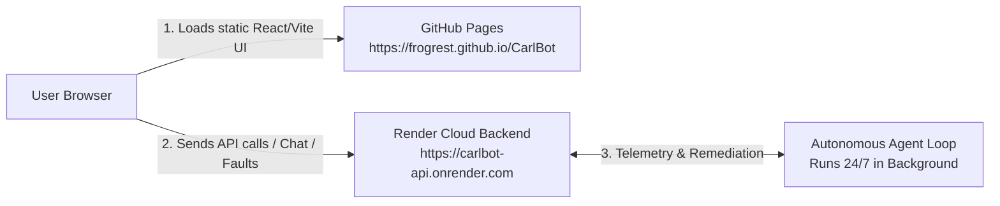

# Setup, Development, and Debugging Guide

## Prerequisites

- **Python 3.11+** (3.11 recommended; 3.14 has pydantic-core compilation issues)
- **Node.js 18+ & npm** (for the React operations web frontend)
- **pip** (included with Python)
- **Git** (for version control)
- **Docker** (optional, for containerised deployment)

## Clean Setup

### 1. Python Virtual Environment

#### Windows PowerShell
```powershell
py -3.11 -m venv .venv
.\.venv\Scripts\Activate.ps1
python -m pip install --upgrade pip
python -m pip install -r requirements.txt
```

#### macOS / Linux
```bash
python3 -m venv .venv
source .venv/bin/activate
python -m pip install --upgrade pip
python -m pip install -r requirements.txt
```

### 2. Frontend Dependencies

```bash
cd frontend
npm install
cd ..
```

---

## Running the Application

### One-Command Full Stack Launcher (Recommended)

```bash
python scripts/run_local.py
```

This starts all five services concurrently:
1. **Operations Web UI**: [http://localhost:5173](http://localhost:5173) (Vite dev server)
2. **Helpdesk API**: [http://127.0.0.1:8001](http://127.0.0.1:8001) ([Swagger docs](http://127.0.0.1:8001/docs))
3. **Operations Portal API**: [http://127.0.0.1:8002](http://127.0.0.1:8002) ([Swagger docs](http://127.0.0.1:8002/docs))
4. **Agent API**: [http://127.0.0.1:8003](http://127.0.0.1:8003) ([Swagger docs](http://127.0.0.1:8003/docs))
5. **Agent Autonomous Loop**: Polling simulator every 5s

Press `Ctrl+C` in the terminal to cleanly terminate all 5 processes.

### Running Individual Services (for Granular Development)

Run each command in its own terminal tab with the virtual environment activated:

```bash
# Terminal 1: Helpdesk Service
uvicorn services.helpdesk.app:app --port 8001 --reload

# Terminal 2: Operations Portal Service
uvicorn services.portal.app:app --port 8002 --reload

# Terminal 3: Agent API Service
uvicorn services.agent.app:app --port 8003 --reload

# Terminal 4: Autonomous Background Polling Loop
python -m services.agent.agent

# Terminal 5: Operations Web Console (Vite)
cd frontend
npm run dev
```

---

## Frontend Architecture

The Operations Web UI is designed specifically for technical support engineers and Network Operations Center (NOC) operators.

### Tech Stack
- **Framework:** React 19 + TypeScript (Strict typing enabled)
- **Bundler & Tooling:** Vite 6 with `@vitejs/plugin-react`
- **Styling:** Vanilla CSS + Tailwind CSS v3.4 (NOC Dark Theme: Slate/Cyan/Amber/Rose)
- **Icons:** `lucide-react`
- **Routing:** React Router v7 (`BrowserRouter`, `Routes`, `Route`, `Navigate`)
- **Testing:** Vitest 3 + `@testing-library/react` + `jsdom`

### Directory Structure

```text
frontend/
├── src/
│   ├── api/                  # Typed API clients for each backend service
│   │   ├── client.ts         # Generic fetch wrapper & ApiError
│   │   ├── helpdesk.ts       # Tickets, search, comments, notes
│   │   ├── portal.ts         # Assets, health, faults, actions, sites
│   │   ├── agent.ts          # State, policy, knowledge, run-once, investigate
│   │   └── types.ts          # TypeScript interfaces matching backend models
│   ├── components/           # Reusable UI & diagnostic components
│   │   ├── chat/             # AI Assistant chat components
│   │   │   ├── ChatContainer.tsx
│   │   │   ├── ChatSidebar.tsx
│   │   │   ├── ChatMessageItem.tsx
│   │   │   └── ChatToolStep.tsx
│   │   ├── common/           # Atomic badges, cards, skeletons, empty states
│   │   │   ├── Badge.tsx
│   │   │   ├── PolicyBadge.tsx
│   │   │   ├── Card.tsx
│   │   │   ├── Skeleton.tsx
│   │   │   └── EmptyState.tsx
│   │   ├── layout/           # Global chrome layout
│   │   │   ├── Header.tsx
│   │   │   ├── Sidebar.tsx
│   │   │   ├── AppLayout.tsx
│   │   │   └── LabControlsModal.tsx
│   │   ├── timeline/         # Diagnostic evidence timeline
│   │   │   └── InvestigationTimeline.tsx
│   │   └── topology/         # Network dependency & outage graph
│   │       └── TopologyGraph.tsx
│   ├── context/
│   │   └── LabContext.tsx    # Global telemetry, polling (6s), notification state
│   ├── pages/                # 10 dedicated operations views
│   │   ├── DashboardPage.tsx
│   │   ├── IncidentsPage.tsx
│   │   ├── IncidentDetailPage.tsx
│   │   ├── DevicesPage.tsx
│   │   ├── DeviceDetailPage.tsx
│   │   ├── SitesPage.tsx
│   │   ├── SiteDetailPage.tsx
│   │   ├── AssistantPage.tsx
│   │   ├── KnowledgePage.tsx
│   │   └── AuditPage.tsx
│   ├── test/                 # Component and unit test suites
│   ├── App.tsx               # Route definitions
│   ├── index.css             # Design tokens and custom scrollbars
│   └── main.tsx              # Application entry point
├── package.json
├── tailwind.config.js
├── tsconfig.json
└── vite.config.ts
```

---

## API Connection & State Management

### Service Endpoints
The frontend connects directly to backend services using configurable environment variables (defaulting to localhost):
- `VITE_HELPDESK_URL` → `http://localhost:8001`
- `VITE_PORTAL_URL` → `http://localhost:8002`
- `VITE_AGENT_URL` → `http://localhost:8003`

Each service enables `CORSMiddleware` allowlisting all origins in development mode.

### Global State (`LabContext`)
- Automatically polls active assets, sites, tickets, faults, and agent state every 6 seconds.
- Emits real-time visual banner alerts when new faults are detected.
- Exposes quick fault injection helpers (`injectFault`, `clearFault`, `clearAllFaults`) for interactive testing.

---

## AI Assistant & Slash Commands

The conversational assistant console (`/assistant`) allows technicians to query state and trigger targeted autonomous investigations.

### Supported Slash Commands

1. **`/investigate <ASSET_ID>`**
   - Triggers targeted investigation on the asset via `POST /investigate/{asset_id}`.
   - Executes real checks (Ping, TCP, RTSP, System metrics).
   - Retrieves matching tickets and authoritative SOP documents.
   - Evaluates the policy engine.
   - If `SAFE_REVERSIBLE`, executes recovery and verifies outcome.
   - If `HUMAN_ONLY` or `APPROVAL_REQUIRED`, safely halts and flags for technician review.

2. **`/status <ASSET_ID>`**
   - Performs an instant telemetry snapshot of the asset without altering ticket state.
   - Returns IP, firmware, status, RTSP state, ping latency, and resource metrics.

3. **`/site <SITE_ID>`**
   - Retrieves site-wide rollups and checks for correlated multi-device outages (e.g., gateway down, switch power failure).

4. **`/history <QUERY>`**
   - Searches historical tickets and technician notes for past resolutions to similar symptoms.

5. **`/help`**
   - Lists all supported commands, syntax examples, and safety constraints.

6. **`/clear`**
   - **Behavior:** Clears the active chat messages and session context in the UI.
   - **Safety Boundary:** Preserves all tickets in the helpdesk, device states in the portal, fault logs, and audit entries. It does **not** wipe backend databases or reset lab state.

### Tool Execution Transparency
When executing commands, the UI renders interactive status pills:
- `Running` (Blue pulsing spinner)
- `Success` (Green checkmark)
- `Failure` (Red warning indicator)
- `Blocked by Policy` (Purple shield indicator)

Technicians can click any tool pill to inspect the exact input arguments and JSON output received from the backend simulator.

---

## Safety Policy Enforcement & Visualization

Every diagnostic finding and proposed remediation displays its assigned safety class:
- 🟢 `SAFE_REVERSIBLE`: Automatically executed if auto-recoverable (e.g. `reconnect_stream`, `restart_service`).
- 🟡 `APPROVAL_REQUIRED`: Proposes remediation but prompts the user for explicit confirmation (e.g. `reboot_host`, `update_config`).
- 🔴 `HUMAN_ONLY`: Prohibits autonomous execution; highlights required physical inspection or credential update (e.g. `hardware_repair`, `credential_rotation`).
- 🔵 `READ`: Diagnostic check without state modification (e.g. `ping_check`, `rtsp_check`).

> **Architectural Invariant:** Policy is enforced strictly on the backend (`services/agent/policy.py`). The frontend reflects policy states visually but has zero ability to bypass safety rules.

---

## Extending the Lab

### Adding a New Page / Route
1. Create your component in `frontend/src/pages/MyNewPage.tsx`.
2. Add the route in `frontend/src/App.tsx`:
   ```tsx
   <Route path="my-page" element={<MyNewPage />} />
   ```
3. Add the navigation item in `frontend/src/components/layout/Sidebar.tsx` with a Lucide icon.

### Adding a New UI Component
1. Place atomic/shared components in `frontend/src/components/common/`.
2. Use existing design tokens (`bg-slate-900`, `border-slate-800`, `text-cyan-400`, `text-slate-100`).
3. Add a corresponding test file in `frontend/src/test/` to verify rendering and user interactions.

### Adding a New AI Diagnostic Tool
1. In `services/agent/agent.py`:
   - Implement the diagnostic check function (e.g. `check_audio_stream(asset)`).
   - Integrate it into `investigate_single_asset()` or `diagnose()`.
2. In `services/agent/policy.py`:
   - Classify the action into `READ`, `SAFE_REVERSIBLE`, `APPROVAL_REQUIRED`, or `HUMAN_ONLY`.
3. In `frontend/src/components/chat/ChatContainer.tsx`:
   - Add the tool execution step to `toolSteps` during command execution so operators can see it running live.

---

## Testing & Production Build

### Running Backend Tests
```bash
# 60 automated unit, API, recovery, and regression tests
python -m pytest -q
python -m ruff check .
```

### Running Frontend Tests
```bash
cd frontend
npm test
```
Vitest executes 26 tests across 7 test suites:
- `FaultSimulatorAndNaturalAI.test.tsx`: Comprehensive QA audit suite for fault dropdown rendering, quick scenarios, device fault compatibility, natural language queries, alias resolution ("lobby camera", "cam 1"), healthy device status reporting, and safety policy explanations.
- `BadgeAndPolicy.test.tsx`: Policy color-coding and safety class labels.
- `ChatCommands.test.tsx`: Command parser, slash command execution, and `/clear` isolation.
- `InvestigationTimeline.test.tsx`: Expandable diagnostic steps and JSON evidence.
- `TopologyGraph.test.tsx`: Topology hierarchy and correlated multi-device outages.
- `SafetyEnforcement.test.tsx`: Human-in-the-loop alerts for non-reversible faults.
- `AppViews.test.tsx`: Navigation, page routing, and empty/error states.

### Production Build
```bash
cd frontend
npm run build
```
Build output is generated under `frontend/dist/` with full type validation and bundle optimization.

---

## Cloud Deployment & GitHub Pages Architecture

CarlBot supports dual-mode deployment: **Local Development** and **Zero-Cost Cloud Deployment**.

### Architecture: GitHub Pages (Frontend) + Render.com (Backend)



1. **Frontend Hosting (GitHub Pages):**
   - Repository: [`frogrest/CarlBot`](https://github.com/frogrest/CarlBot)
   - Hosted at: `https://frogrest.github.io/CarlBot/`
   - Automated via GitHub Actions workflow (`.github/workflows/deploy.yml`) on every push to `main`.
   - Build configured with Vite base path: `/CarlBot/`.

2. **Backend Hosting (Render.com Free Web Service):**
   - Single unified gateway app (`services/gateway.py`) mounting Helpdesk, Portal, and Agent microservices on a single port.
   - Background worker: Starts the continuous autonomous agent loop (`run_forever()`) on server startup.
   - Free tier includes automatic SSL (`https://`), preventing mixed-content warnings.

3. **In-Browser Resilience Mode:**
   - Free cloud instances sleep after 15 minutes of inactivity.
   - The frontend includes in-memory simulated fallback mode so visitors can immediately test the interactive lab and AI Assistant without waiting for cold-start wakeups.

---

## Resetting Lab State

To reset all tickets, faults, device status overrides, and agent state back to the seed baseline:

```bash
python scripts/reset_lab.py
```
On the next cycle or page refresh, all demo assets return to a healthy state and default sample tickets are restored.
