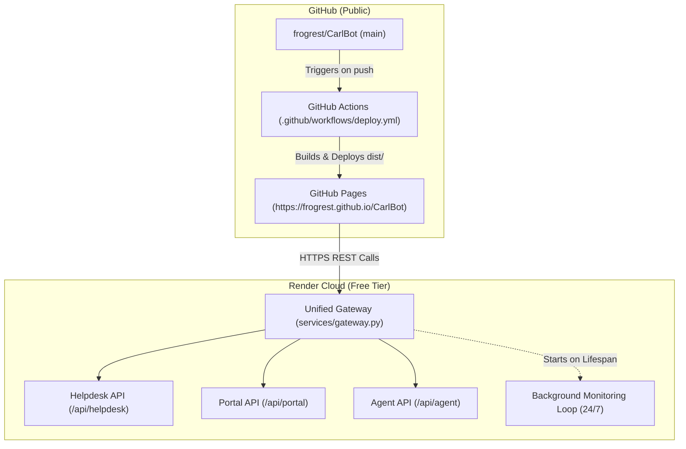

# 🚀 CarlBot: Deployment & Technical Roadmap Plan

**Target Repository:** [`frogrest/CarlBot`](https://github.com/frogrest/CarlBot)  
**Status:** All 60 Backend Tests Pass (Pytest) | All 26 Frontend Tests Pass (Vitest) | Pushed to `main`  
**Execution Date:** Planned for Next Session  

---

## 📋 Executive Overview

This plan outlines the exact implementation steps to take **CarlBot (CCTV AI Support Lab)** from local execution to a live, publicly accessible web application with zero hosting costs:
1. **Frontend:** Hosted on **GitHub Pages** via automated GitHub Actions CI/CD.
2. **Backend:** Hosted on **Render.com** (Free Tier) as a unified FastAPI web service running all 3 microservices and the continuous autonomous agent monitoring loop.
3. **Resilience Layer:** In-browser mock fallback so the web app remains interactive even during cold starts.



---

## 🛠️ Phase 1: Unified Cloud Backend Architecture

> [!NOTE]
> Currently, the lab runs on three independent local ports (`8001`, `8002`, `8003`). Free cloud tiers (Render / Railway / Fly.io) provide **one public port and one HTTPS URL**. Creating a unified gateway solves this cleanly.

### Task 1.1: Create Unified Gateway (`services/gateway.py`)
- **Objective:** Mount Helpdesk, Portal, and Agent apps under a single root FastAPI app with unified CORS and health check.
- **Specification:**
  - `GET /health` → Aggregate health check returning status of all 3 services.
  - Mount `/api/helpdesk` → `services.helpdesk.app:app`
  - Mount `/api/portal` → `services.portal.app:app`
  - Mount `/api/agent` → `services.agent.app:app`
  - **Lifespan Task:** Launch `run_forever()` from `services.agent.agent` as an asynchronous background worker when the gateway starts.
- **Local Validation:** Run `uvicorn services.gateway:app --port 8000` and verify all endpoints and the background agent loop function as expected.

### Task 1.2: Cloud-Aware Port Configuration (`Dockerfile` & `render.yaml`)
- Add a lightweight `render.yaml` or container definition to configure:
  ```bash
  uvicorn services.gateway:app --host 0.0.0.0 --port $PORT
  ```
- Ensure runtime storage (`data/runtime/`) writes safely in ephemeral cloud disk environments.

---

## 🌐 Phase 2: Frontend & GitHub Pages Pipeline

### Task 2.1: Configure Base Path & Client Routing (`frontend/vite.config.ts`)
- GitHub Pages hosts project sites under a sub-path (`https://frogrest.github.io/CarlBot/`).
- Update `vite.config.ts` to set dynamic base path:
  ```ts
  base: process.env.NODE_ENV === 'production' ? '/CarlBot/' : '/'
  ```
- Ensure React Router `BrowserRouter` or `HashRouter` handles sub-route refreshes without returning GitHub Pages 404 errors (include standard `404.html` SPA redirect script).

### Task 2.2: Dynamic API Client Configuration (`frontend/src/api/client.ts`)
- Support environment-driven API URLs with local fallbacks:
  - `VITE_API_URL`: Points to `https://carlbot-api.onrender.com` in production, or `http://localhost:8000` / split ports in development.
  - Prefix API calls to `/api/helpdesk`, `/api/portal`, `/api/agent`.

### Task 2.3: GitHub Actions Automated Deployment (`.github/workflows/deploy.yml`)
- Create workflow triggered on `push` to `main`:
  1. Check out repository.
  2. Set up Node.js 20.
  3. Install dependencies: `npm ci` in `frontend/`.
  4. Run tests: `npm test`.
  5. Run build: `npm run build` (with `VITE_API_URL` injected).
  6. Upload build artifacts to GitHub Pages (`actions/deploy-pages@v4`).

---

## 🛡️ Phase 3: Resilience & Cold-Start Experience

> [!TIP]
> Free cloud servers (like Render) sleep after 15 minutes of inactivity and take ~30–45 seconds to wake up. Adding in-browser resilience guarantees immediate first-load satisfaction.

### Task 3.1: In-Browser Demo Fallback Mode
- If the frontend detects that the cloud backend is waking up (`503` or timeout > 4s), display an informative header pill:
  - 🟡 `Waking Cloud Backend...`
- Provide an instant **"Use In-Browser Demo Mode"** toggle that runs the simulated device state and deterministic policy diagnoses in local storage until the backend responds.

### Task 3.2: Visual Backend Connection Status Indicator
- Add a persistent latency / connectivity status indicator to [`Header.tsx`](file:///f:/HelpDeskAiEmulator/cctv-ai-support-lab/frontend/src/components/layout/Header.tsx):
  - 🟢 **Online (Render Cloud)**: Full autonomous loop active.
  - 🟡 **Waking Up (Cold Start)**: Displays wake-up countdown progress.
  - 🔵 **Standalone Demo**: Client-side simulated mode.

---

## 📈 Phase 4: Feature Enhancements (Post-Deployment Roadmap)

| Feature | Description | Priority |
|---|---|---|
| **SSE / WebSocket Live Stream** | Replace 6-second polling with real-time push events when faults are injected or resolved. | High |
| **PDF / Markdown Incident Export** | Generate formal post-incident technical reports from the Incident Detail view for compliance audits. | Medium |
| **Live Camera Snapshot Generator** | Use SVG/Canvas canvas generator to produce simulated camera frames (normal, frozen, color bars, black screen) for visual realism. | Medium |
| **Optional Gemini API Reasoning** | Add an API key field in settings to enable live multi-modal LLM reasoning side-by-side with the deterministic rule engine. | Low (Optional) |

---

## ✅ Immediate Action Checklist for Tomorrow

When you return tomorrow, here is the exact step-by-step checklist we will execute together:

1. [ ] **Code Implementation:** Build `services/gateway.py` and verify all 3 services + agent loop run on a single unified port.
2. [ ] **Frontend Updates:** Configure `vite.config.ts` base path and create `.github/workflows/deploy.yml`.
3. [ ] **Testing:** Run full local test sweep (`npm test`, `pytest`, `npm run build`) to ensure 100% pass rate.
4. [ ] **Git Push:** Push the deployment pipeline to GitHub `main`.
5. [ ] **Render Setup:** Step-by-step 3-minute link-up on Render.com to generate your live backend URL.
6. [ ] **Live Verification:** Verify the live application running at `https://frogrest.github.io/CarlBot`.
